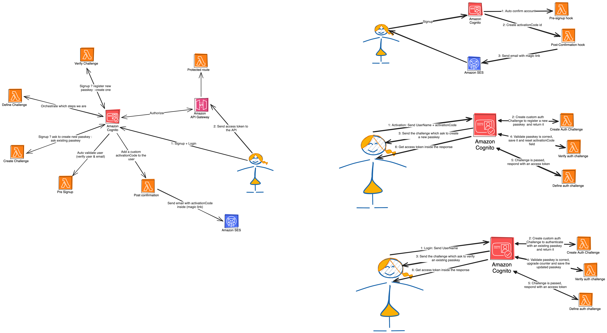

# Passkey authentication with AWS Cognito

Enhance AWS Cognito to initiate FIDO2 Passwordless Authentication.

Demo: [https://passkeys.unicornpowered.io](https://passkeys.unicornpowered.io)

> Disclaimer note: Do not use this project directly in production. It may be result of potential data privacy breach, it's just a proof of concept of how to use AWS Cognito with FIDO2 Authentication (Passkeys). You have to adapt it before using it !

## Useful commands

- `yarn` install dependencies
- `yarn build` compile typescript to js
- `yarn deploy` deploy this stack to your default AWS account/region

This project require an active hosted zone already registered by route 53 at the domain defined in the cdk.json context. If you want to deploy it directly, you should have one hosted zone registered, otherwise, you can comment it and use the default domain name generated by cloudfront. You must be in HTTPS to use passkeys.

Under the `frontend`` folder:

- `yarn` install dependencies
- `yarn dev` launch a dev server
- `yarn build` build frontend

## Deploy

Under the `frontend`` folder:

- `yarn build` build frontend

Then at the root

- `yarn deploy`

## Ressources

Resource that I found useful during my research.

- [FIDO Website](https://fidoalliance.org/)
- [Passkeys: Explainer the future of passwordless authentication](https://www.smashingmagazine.com/2023/10/passkeys-explainer-future-password-less-authentication/)
- [SimpleWebAuthn](https://simplewebauthn.dev)
- [WebauthN with Cognito Github](https://github.com/aws-samples/webauthn-with-amazon-cognito/tree/master)
- [CDK Serverless Cognito FIDO2 Github](https://github.com/lockdrop/cdk-serverless-cognito-fido2-webauthn)
